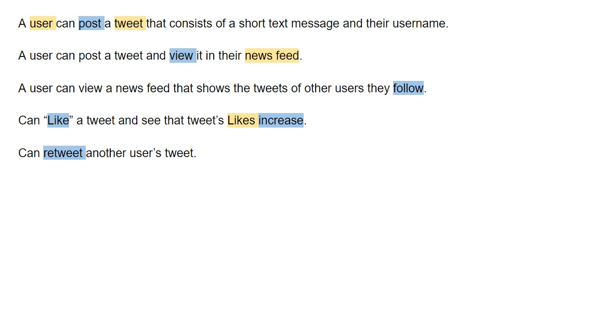

1) Look at your specs and/or user stories



2) Highlight nouns in specs--those are likely candidates for objects
3) Highlight verbs in specs--those are likely candidates for methods 
  _Note: Figuring out what objects should hold those methods can be a challenge, but generally an object should track its own info/be responsible for itself._

Nouns = objects
- User
- Tweet
- Newsfeed

Verbs = methods that go along with an object
#### User
 - Post
 - Like
 - Retweet
 - Follow

#### Tweet
 - increaseLikes
#### Newsfeed
 - Show

4) Code!
```
function User(name) {
  this.userName = name;
  this.tweets = [];
  this.followers = []
  this.follows = [];
}
User.prototype.post = function (message) {
  var newTweet = new Tweet(message);
  this.tweets.push(newTweet);
}
User.prototype.like = function (tweet) {
  tweet.likes += 1;
}

function Tweet(text) {
  this.text = text;
  this.likes = 0;
  this.retweets = 0;
}

function Newsfeed() {
  this.posts = []
}

Newsfeed.prototype.show(userId) {
// will get list of posts by all that user is following
}
```

And so on and so forth! 😄

More resources: The Lynda/LinkedIn Learning* course <a href = "https://www.lynda.com/Python-tutorials/Programming-Foundations-Object-Oriented-Design/731735-2.html"> Programming Foundations: Object-Oriented Design</a> is helpful and very approachable but it's better if you've already learned about classes and some basics of OOP. 

*Seattle (and Portland?) library card holders already have subscriptions to Lynda!